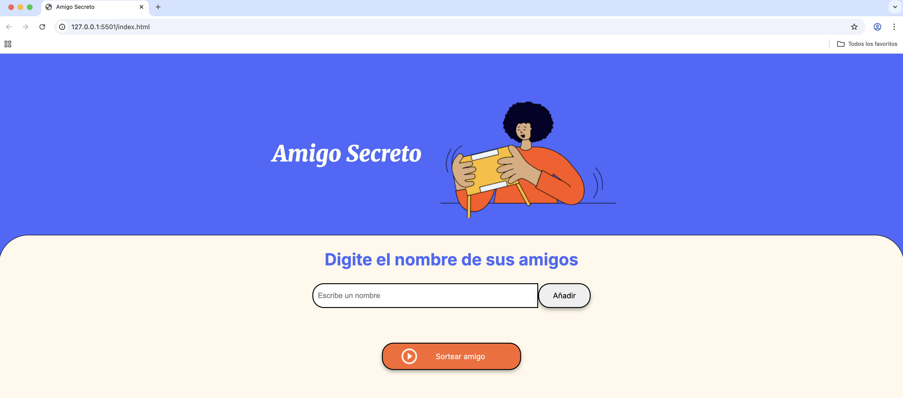

# Challenge Amigo Secreto
Este proyecto fue realizado para poner en practica lo aprendido en los cursos logica de programación: sumérgete en la programación de JavaSacript y Git y GitHub: repositorio, commit y versiones.

# Uso del juego
* Ingresa el nombre de un amigo en el campo texto
* haz clic en "Agredar" para añadirlo a la lista de amigos
* Cuando ingreses todos los amigos, presiones "Sortear Amigo" para elegir uno al azar
* No se permite repetir los nombres

# Resultado Final

# Estructura del Proyecto 

* assets/    ---> Estructura del juego
* app.js     ---> Logica del juego
* style.css  ---> Estilos
* assets/    ---> Imágenes

# Autor
Kevin Gamarra Cordova
* Correo: kcordova@myevol.biz
* Usuario en URL: https://app.aluracursos.com/user/kcordova
